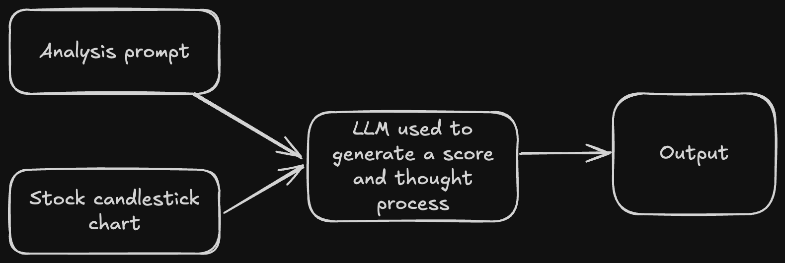

# llmstockpicks

## Overview
Building an application to pick stocks using LLMs for a long-only portfolio.

## Architecture
We can divide the architecture section in two parts. First, the single stock analysis architecture and then we can talk about the screener architecture we can build.

### Single stock analysis architecture

The first step here is we design a prompt such that LLM thinks about it from a long-only portfolio perspective. Then, we need to provide it a long enough window to generate the candlestick chart so it can clearly see the trend on a daily timeframe. I chose 3 months for it which is equivalent to one quarter. We also need to ensure it always returns a JSON output. So, this is the prompt I created:
```
req_prompt = f"What can you infer from this {stock_symbol} chart? Based on the chart, give me a score of 1-10 on whether you would hold this in your long only portfolio for the upcoming week and give your thought process. Give me JSON output with keys including score and thought_process."
```

And here is a sample for running it on AAPL stock on 2025-04-20:
```json
{
"score": 4,
"thought_process": "The AAPL chart shows a downtrend from late February to early April, followed by a sharp drop. There is a mini uptrend near the end with some positive signals, but the overall downward momentum and increased recent volatility makes me hesitant for a purely long-only strategy. To make the call easier many days would be needed since the upward momentum has occurred on small bounces. To make an educated recommendation, a broader market analysis and individual fundamental analysis would be needed."
}
```

### Screener architecture
We follow the same single stock architecture here but this time we iterate on all the S&P 500 stocks list. Then we rank them in descending based on the score the LLM gives and put everything in a CSV file. You can find a sample ranking output [here](src/weekly_recommendations.csv).

## Dashboard
Here we can see how the LLM output looks like for a single stock.

https://github.com/user-attachments/assets/d7eed627-ceda-4d27-a850-a70c5d3b0fe7
